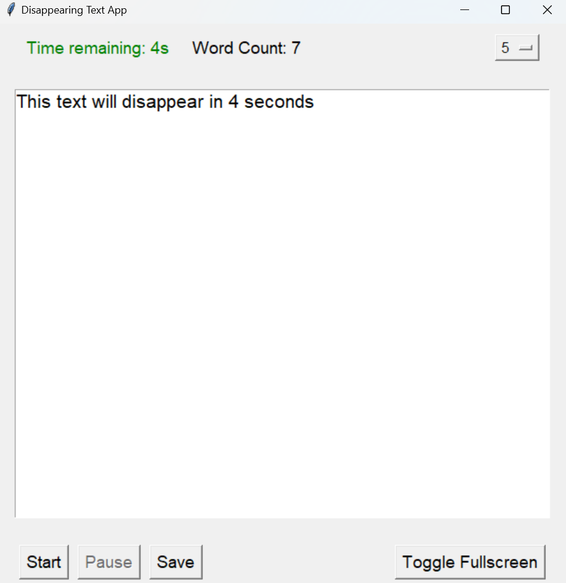

# Disappearing Text App

A motivational writing application where your text vanishes if you stop typing for too long.



## Features

- Set a timer that determines how long you can pause between keystrokes.
- If you stop typing and the timer reaches zero, your text disappears.
- Save your work at any time.
- Toggle fullscreen mode for a distraction-free writing experience.
- Word count to track your progress.
- Sound alerts for timer countdown and when time's up.

## Installation

1. Clone this repository:
```bash
git clone https://github.com/MariosAvraam/disappearing-text-app.git
```

2. Navigate to the directory:
```bash
cd disappearing-text-app
```

3. (Optional) Create a virtual environment:
```bash
python -m venv venv
```

4. (Optional) Activate the virtual environment:
```bash
# On windows venv\Scripts\activate
# On macOS and Linux: source venv/bin/activate
```

5. Installing Dependencies:
```bash
pip install -r requirements.txt
```

6. Running the App:
```bash
python main.py
```

## Contributing

Pull requests are welcome. For major changes, please open an issue first to discuss what you would like to change.

## License

This project is licensed under the MIT License.